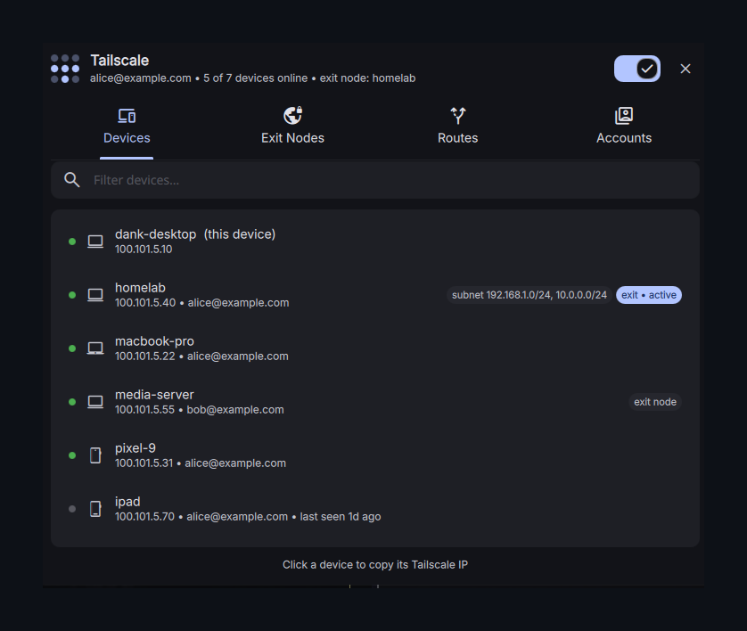
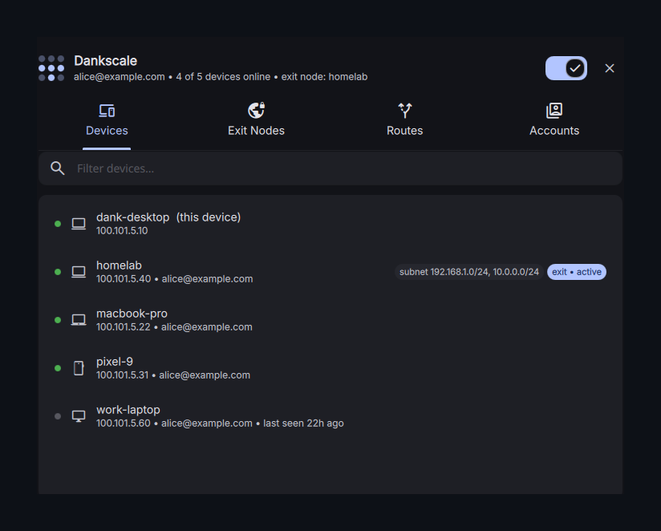

# Dankscale

A DankMaterialShell (Quickshell) plugin that manages your Tailscale network from the bar — a Linux stand-in for the macOS menu-bar app and settings utility.



## Features

**Bar widget** — Tailscale icon showing connection state, with a shield badge when an exit node is active and an error badge when login is required or `tailscaled` is down.

**Drop-down (click the bar icon)**
- Connect / disconnect toggle
- Current account, one-click switch to the next account
- Current exit node, one-click disable
- Device list — click any device to copy its Tailscale IP (or MagicDNS name) to the clipboard
- "Open Manager" button

**Manager (popup)**
- **Devices** — filterable list of every device on the tailnet with online status, OS, owner, subnet/exit-node badges; click to copy address
- **Exit Nodes** — pick or clear the exit node, allow-LAN-access toggle, advertise this device as an exit node
- **Routes** — accept-routes toggle, advertise subnet routes from this device, list of subnet routers on the tailnet
- **DNS** — "Use Tailscale DNS" toggle, current DNS configuration (MagicDNS state, suffix, this device's DNS name, search domains, split-DNS routes), and a DNS lookup tool that resolves names through the tailnet resolver
- **Accounts** — switch between logged-in accounts, add a new account (opens browser sign-in)



**Control center tile** — Tailscale toggle in the DMS control center.

## Requirements

- DankMaterialShell ≥ 1.4.0
- `tailscale` CLI with `tailscaled` running
- `wl-copy` (wl-clipboard)
- Your user set as the Tailscale operator so no root prompts are needed:

  ```sh
  sudo tailscale set --operator=$USER
  ```

## Install

**From the plugin browser** — search for **Dankscale** in DMS Settings → Plugins and install it.

**Manually** — clone into your DMS plugins directory:

```sh
git clone https://github.com/dwright134/dms-tailscale ~/.config/DankMaterialShell/plugins/Dankscale
```

Then enable **Dankscale** under Settings → Plugins.

## Settings

- **Refresh interval** — how often `tailscale status` is polled (default 5 s)
- **Click copies** — Tailscale IPv4 (default) or MagicDNS name
- **Show offline devices** — include offline devices in the drop-down list

## How it works

Everything is driven by the `tailscale` CLI — no daemons, no external helpers:

- `tailscale status --json` — device list, connection state, exit node
- `tailscale debug prefs` — accept-routes, advertised routes, exit-node and accept-dns prefs
- `tailscale dns status --json` — MagicDNS state, suffix, search domains, split-DNS routes
- `tailscale dns query <name> [type]` — DNS lookup tool
- `tailscale switch --list` / `tailscale switch <account>` — accounts
- `tailscale up` / `down` — connect / disconnect
- `tailscale set --exit-node=… --accept-routes=… --advertise-routes=… --accept-dns=…` — settings
- `tailscale login` — add account (auth URL opens in your browser automatically)

## License

[MIT](LICENSE)
